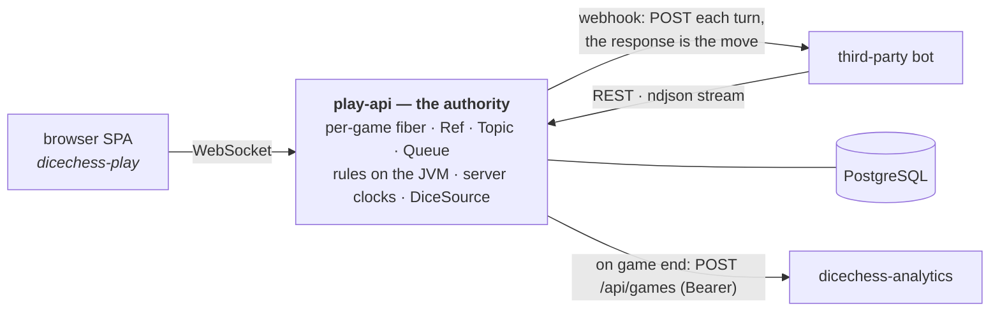

# Dice Chess Play API 🎲♟️

[](https://github.com/fortemate/dicechess-play-api/actions/workflows/ci.yaml)
[](https://fortemate.com/)
[](./LICENSE)

Authoritative real-time server for **Dice Chess** — human-vs-human play, a third-party **Bot API**, and an automatic **Glicko-2 rating ladder**.

> **Status: live.** Authoritative HvH over WebSocket, the full Bot API (REST + ndjson event streams + webhooks), PostgreSQL durability with crash recovery, analytics hand-off, and a continuously-paired Glicko-2 rating ladder.

## Architecture

Scala 3 · cats-effect · http4s (Ember), reusing the **dice-chess rules on the JVM** (`com.fortemate:dicechess-rules`, the rules half of the engine) so move legality and rules never drift from the client. The search half of the engine is a test-only dependency: it plays the sparring opponents in the suites and never enters the server.



**Transport-agnostic player — the core principle.** A `GameRoom` does not know whether a player is a human over WebSocket or a bot over HTTP. A player is *something that receives game events and submits commands*, identified by a `Principal` and seated at a `Seat`. The website WS and the Bot API are two thin adapters over the same room — the game logic is written once and is identical for human-vs-human, human-vs-bot, and bot-vs-bot.

### Dice fairness

The **server** generates dice (CSPRNG), wrapped in **commit-reveal** so every roll is provably fair after the fact, behind a swappable `DiceSource` interface. No client ever rolls.

### Bot API

Third-party bots connect via a dedicated API — a token plus any of three connection modes: REST polling, an ndjson event stream, or a single serverless **webhook** (the server POSTs each turn, the HTTP response is the move). Language-agnostic and reconnect-safe.

## Documentation

- **[Bot API](https://bots.fortemate.com/)** — connect a bot in minutes: REST, streaming, or one serverless webhook; OpenAPI reference included.
- **[Contributor docs](https://fortemate.github.io/dicechess-play-api/)** — how the server is built: architecture, database schema, concurrency doctrine, testing conventions.
- [`CONTRIBUTING.md`](./CONTRIBUTING.md) for the pull-request workflow and [`SECURITY.md`](./SECURITY.md) for reporting vulnerabilities.

## Quick Start

### Prerequisites

- [mise](https://mise.jdx.dev/) (manages Java, sbt, scalafmt, and developer tools)
- PostgreSQL (or run via Docker / Testcontainers)

```bash
mise run setup       # Install dependencies & register git hooks
mise run compile     # Compile Scala sources
mise run test        # Run unit & integration tests
mise run check       # Run the full CI quality gate locally
mise run run         # Start local server on :8080
```

## License

Licensed under the [GNU Affero General Public License v3.0](./LICENSE).
