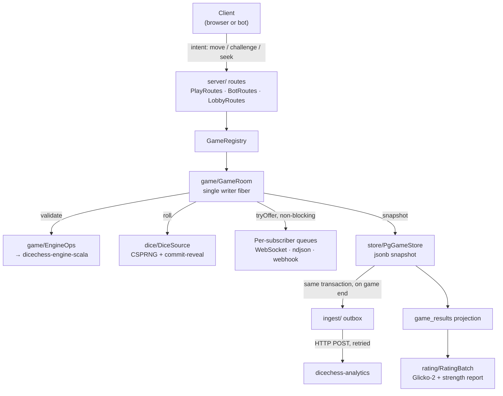
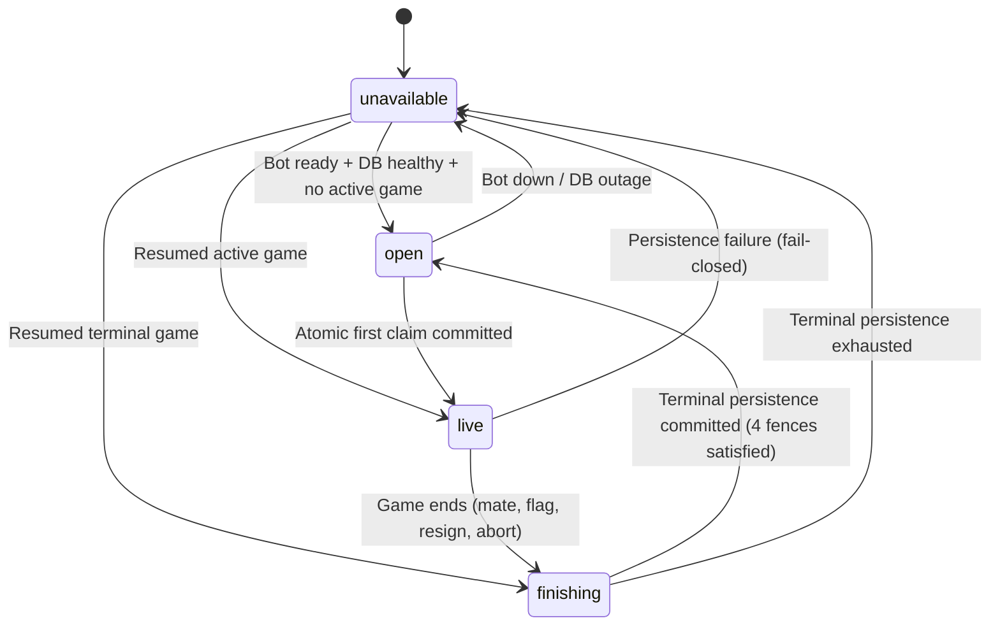

A single sbt module. The entry point is `dicechess.play.Main` (an `IOApp.Simple` serving Ember
on `0.0.0.0:8080`), which reads the environment and wires up the optional subsystems —
persistence, analytics ingest, the ladder scheduler, the rating batch, webhook push, and
retention. Each is opt-in; see [Configuration](/dicechess-play-api/configuration/).

## Package map

Everything lives under `src/main/scala/dicechess/play/`.

| Package | Owns |
| --- | --- |
| `core/` | Domain types with no dependencies: `Protocol`, `Identity` (Seat / Principal), `GameId`, `Seek`, `BotEvent` |
| `dice/` | `DiceSource` — server-only CSPRNG dice with commit-reveal fairness |
| `game/` | `GameRoom` (the actor-style room), `EngineOps` (the only engine wrapper), `PlayerConnection` |
| `server/` | http4s routes and the services behind them — the largest package |
| `store/` | `GameStore` / `PgGameStore` (doobie + Flyway), `GameArchive`, `Retention` |
| `rating/` | `Glicko2`, `RatingBatch`, and the strength report: `Sprt`, `BradleyTerry`, `StrengthReport`, `StrengthCache` |
| `ingest/` | `PlaysiteIngest` + `IngestDeliverer` — the transactional outbox to analytics |
| `wire/` | `Codecs.scala` — the Circe codecs that *are* the client wire contract |

## How a move travels

The shape to hold on to: **the room is the only writer of game state**, and everything
downstream of it — subscribers, snapshots, the outbox — is fed without ever letting a slow
consumer block play. That rule is spelled out in
[Concurrency Doctrine](/dicechess-play-api/concurrency/).

## Cross-repository contracts

`play-api` sits in the middle of four contracts. Changing either side of one without the other
is the most common way to break the platform.

- **Consumes** `lv.id.jc:dicechess-engine-scala`, a JVM artifact from GitHub Packages with the
  version pinned in `build.sbt`. It is the single source of truth for the rules — legality is
  never reimplemented here. Legal moves ship on the wire as a prefix tree of UCI micro-moves.
- **Publishes** the client wire protocol in `wire/Codecs.scala`, consumed by the
  `dicechess-play` SvelteKit front end. Both sides must be verified together.
- **Publishes** the analytics ingest payload built in `ingest/PlaysiteIngest.scala` — posted to
  the analytics service's `/api/games` with `source=playsite`, idempotent, first writer wins.
- **Publishes** the public Bot API, documented at [bots.fortemate.com](https://bots.fortemate.com/). Its
  machine-readable contracts (`openapi.yaml`, `asyncapi.yaml`) live in that site's `public/`
  directory and are rendered into the reference at build time, so the spec cannot drift
  silently from the docs.

## HTTP surface

Routes are grouped by audience rather than by resource:

- **Operational** — `GET /health`, `GET /version`.
- **Human game surface** — `POST /games`, `GET /games/{id}`, `GET /games/{id}/ws?token=…`. The
  token grants the seat; redeeming it is also when the seat learns who is sitting in it (#285),
  from the session or a `?guest=` uuid.
- **Public discovery** — `GET /games`, `GET /leaderboard`, `GET /bots/{team}/{name}`, plus the
  history and strength endpoints.
- **Showcase table** — `GET /showcase` and `POST /showcase/claim` (ADR-005, #46), mounted only with
  `SHOWCASE_ENABLED=true`. The homepage's singleton table:
  - `GET /showcase` is the public read: `status` (`unavailable`, `open`, `live`, `finishing`), the
    featured bot, the fixed `5+3`, `nextHumanColor` when open (and, while a game is on, the colour offered
    next), `currentGame` and a spectator `wsUrl` when live or finishing, and a coarse `reason`
    (`disabled`, `maintenance`, `bot_unavailable`) when unavailable. It is `Cache-Control: no-store,
    no-cache, must-revalidate` with a weak `ETag` (`If-None-Match` answers `304`), needs no
    authentication, and **never carries a seat token, a webhook detail, a private identity or
    infrastructure state**. Colours use the existing `Side` wire form (`White` / `Black`).
  - `POST /showcase/claim` is the atomic first claim. The actor is the session account (then
    `X-DiceChess-CSRF: 1` and an `Origin` on the `PLAY_CORS_ORIGINS` allow-list are both required; a
    deployment without an allow-list refuses the session path, so visitors claim as guests there) or a
    stable `guestId` in the body. The body is capped at 4 KiB. `Idempotency-Key` (a UUID) is mandatory; `clientEntropy` is an optional
    dice seed. The winner gets `200` with `outcome: "claimed"`, `seat`, `seatToken` and a relative
    `wsUrl`, under `Cache-Control: no-store, private`; every other caller gets `200` with
    `outcome: "spectating"`, a `reason` (`already_claimed` / `game_ended`), the `gameId` and a
    `spectatorWsUrl` — and **no credential**. Problems are RFC 7807 (`application/problem+json`) with a
    `code`: `400` `missing_idempotency_key` / `invalid_idempotency_key` / `guest_required` /
    `invalid_guest_id` / `malformed_request`, `403` `csrf_origin_rejected`, `409`
    `idempotency_conflict` (same key, different body), `413` `request_too_large`, `415` `malformed_request`, `429` `rate_limited`
    (per IP and per actor, `Retry-After`), `503` `showcase_unavailable` (`Retry-After`). WebSocket URLs
    are relative references against the API origin; the server does not guess its public hostname.
    The authoritative contract is ADR-005 (#44); the machine-readable one is `openapi.yaml`.
- **Bot API** — everything under `/bot/…`: identity, challenges, seeks, gameplay, streams,
  webhooks, ladder.
- **Account control** — `/me/…` uses the live `access_token` session and current ownership;
  `/admin/…` additionally requires the account id in `PLAY_ADMINS`. The parallel staged webhook
  roots share `SessionWebhookRoutes` and `WebhookManagement`, so only authorization differs —
  status mapping, CAS, redaction, verification, and audit cannot drift between them. They mount
  only behind `WEBHOOK_SESSION_MANAGEMENT_ENABLED` plus persistence, session verification, and an
  explicit origin allow-list; the legacy `/bot/webhook…` contract remains separate. The accepted
  security/state-machine contract is ADR-004; this page and
  [Concurrency](/dicechess-play-api/concurrency/) carry everything a contributor needs from it.

The complete, authoritative reference for the bot-facing routes is the
[Bot API site](https://bots.fortemate.com/), not this page.

## Staged webhook control plane

The staged path deliberately separates browser authorization, durable credential state, and
outbound networking:

1. `SessionWebhookRoutes` authenticates the live owner/admin session and enforces exact Origin,
   CSRF, content type, and strong `If-Match` requirements.
2. `WebhookManagement` validates the typed transition, performs a DB-authoritative authority and
   revision preflight, then consumes the shared verification budget and coordinates the lease
   around verification-v2 without exposing stored candidate material. The store repeats authority
   and CAS checks at mutation/commit time; unauthorized or stale requests spend no budget and cause
   no DNS or outbound HTTP.
3. `WebhookManagementStore` / `PgGameStore` own the authoritative revision, registration
   generation, setup/tombstone lifecycle, admin-authority heartbeat and audit transaction. Security
   deadlines use the PostgreSQL clock, and activation attempts are reserved when the lease is
   acquired.
4. `WebhookTransport` resolves and validates the candidate once, connects to that validated public
   IP, and retains the hostname for HTTP Host and TLS SNI. The ordinary delivery path reuses this
   DNS-pinned primitive and checks `registration_id` again before a response can enter `GameRoom`.

`Main` mounts the routes and supervises the 5-second admin-generation heartbeat only when the
complete staged configuration is present. A generation is live for 20 seconds; overlapping admin
allow-list generations fail closed until the old one ages out. Deployment ordering is part of the
architecture, not an operations afterthought: follow the
[staged webhook rollout runbook](/dicechess-play-api/configuration/#staged-webhook-rollout-runbook),
including the old-writer/worker drain, DNS-pinning proof, compatible runtime v2 dual-key release,
and flag-off rollback.

## Singleton showcase table

The homepage (`fortemate.com`, route `/`) exposes exactly one permanent public Dice Chess table facing
a configurable featured bot (initially `rpi3/hunter-book`) at casual/unrated `5+3`. When open, the first
visitor to claim it atomically starts one game; all other visitors spectate that same game. The existing
play site remains unchanged at `/play`.

The table moves through four public states:

1. `unavailable`: The table cannot accept claims. Set when PostgreSQL is unconfigured or unreachable,
   the featured bot's webhook is unresponsive, or startup reconciliation detects ambiguous state.
2. `open`: The table is idle, advertising the configured featured bot, `5+3`, and the server-assigned
   next human color. Exactly 1 bot capacity slot is reserved.
3. `live`: One active game against the featured bot is in progress. The winning claimant holds the human
   seat's credential (`seatToken`), which appears **only** in the winning `POST /showcase/claim` response body
   under `Cache-Control: no-store, private`; spectators observe via the ordinary spectator WebSocket.
   `GET /showcase` and spectator outcomes (`outcome: "spectating"`) never include a credential.
4. `finishing`: The game has ended but the table has not yet been released — the window between the room's
   committed terminal transaction and the coordinator clearing the table's current game. A claim in this
   window spectates. The table cannot be `open` before the archive row exists (`GameRoom.result` fires only
   after the terminal commit) and the reserved seat has been released.

### The coordinator (#46)

`server/ShowcaseTable` is the table: one process-local actor holding the phase and a mutex every claim
runs under, so "first visitor wins" is decided by lock order — exactly one claimant can find the table
`open`. It remembers nothing across a restart; the next human colour, the current game and the claim
idempotency records live in PostgreSQL behind `store/ShowcaseStore` (tables `showcase_table` and
`showcase_claims`, V6), and `ShowcaseTable.reconcile` rebuilds the phase from them **before the port
opens** (`Main` runs it inside the resource that mounts the routes). Reconciliation reads
`PgGameStore.activeShowcaseGameIds`: none → the table may open (after repairing a stale current-game
pointer left by a crash between the terminal commit and the clear — and only once that repair has
committed; a store that will not take it keeps the table `unavailable`); exactly one → the resumed room is
adopted as `live` (and the colour advanced if the claim transaction never got to); several → split-brain,
`unavailable` with an operator alert. A live showcase game the registry failed to resume, a store that is
not PostgreSQL, or a bot that fails its readiness probe all fail closed the same way.

A winning claim does, in order: `AdmissionGuard.admitAndCreate` under the `showcase` purpose (the reserved
seat; the room's creation snapshot commits fail-closed inside it), then one store transaction that advances
the colour, points `showcase_table.current_game_id` at the room and writes the claim record — fenced on the
colour the human was seated on and on no game being current — and only then the `live` phase and the
credential. A failed creation advances nothing. A failed commit aborts the room it just created (a
technical abort, archived as such) and fails the table closed rather than guess which side is right. The
winner's `clientEntropy`, when given, is submitted to the room as its dice seed.

Completion is inherited from the room: `GameRoom.result` completes only once the terminal transaction is
durable, the coordinator then waits for the registry to deregister the game (which releases the reserved
seat), clears `current_game_id`, and reconciles again — a bot probe, then `open` or `unavailable`. A
duplicate completion finds nothing to clear and reconciles to the same phase. A winner that never opens its
socket within the claim grace (30 s) is resigned by the coordinator, through the same command a dropped
connection already uses. While the table is not live, a readiness loop (every 15 s) re-runs reconciliation
so a bot that stops answering closes the table before anyone claims a dead one, and a bot or database that
recovers reopens it without a restart. `Main.showcaseReadiness` is the probe: the featured bot must be a
registered identity, webhook delivery must be enabled, and its webhook must answer the unsigned
verification echo within 5 s.

### Fail-closed persistence and recovery rules (#47)

A showcase room runs under `Durability.Required`; every other room keeps the availability-first
`Durability.BestEffort` it always had (a failed snapshot write is logged and the game plays on in
memory). `GameRegistry` picks the mode from the game's origin, at creation and again on resume,
and refuses to create a showcase room at all over a store that does not claim durability
(`GameStore.durable` — the in-memory store does not). Under the required mode:

- **Nothing is published before it is committed.** The room's writer fiber persists a version
  first and only then updates its state and broadcasts. Turn acknowledgement (`submitTurn`'s
  verdict), spectator WebSocket events and the bot webhook's `yourTurn` are all downstream of that
  broadcast, so none of them can carry an uncommitted version. The creation snapshot — with
  `origin = 'showcase'` — is fail-closed in every mode and is what a claim's success answer
  depends on.
- **A failed write halts the room and is retried.** Forward progress stops (no command is
  processed while the write is retried), the mover's clock is credited for the stall, and every
  attempt is reported through `PersistenceTelemetry` — in production one stderr line per event
  naming the game and version, saying whether the room is retrying, has given up, or is back.
  Intermediate writes retry a bounded number of times (four, ~3 s of backoff, each attempt under
  the store's own save timeout); the ending retries **without bound**, backing off to one attempt
  every 30 s.
- **An exhausted intermediate write is a technical abort from the last durable version.** The
  unsaved move or roll is discarded — a subscriber never saw it — and the room ends with
  `termination = aborted` built from the last committed state. That abort is itself a terminal
  write and follows the terminal policy.
- **Completion follows the commit.** `GameRoom.result` — and with it the registry's
  deregistration, the admission release and the coordinator's completion hook — fires only once
  the terminal transaction (final snapshot, `game_results`, immutable `game_archive`, outbox
  payload) has committed. Duplicate deregistration is a no-op, so a repeated completion cannot
  reopen the table early.
- **Stalled sessions are released, not left hanging.** Once a write has been failing for longer
  than the stall grace (15 s), the room drops its subscribers so their WebSockets close; the room
  keeps retrying, `GameRoom.persistenceStalled` reads `true` for the coordinator to answer
  `unavailable`, and a client that reconnects sees the last durable state.
- **Restart resumes from the last durable version.** There is no partially finalised durable
  state to reconcile: the terminal write is one transaction, so a game is either still `active`
  in `games` (resumed by `GameRegistry.resume`, under the required mode again) or fully ended with
  its archive row. An in-memory ending that never committed before a crash is therefore not an
  ending — the game resumes at its last committed version, its clocks restart, and it ends again
  by play, durably.

The full specification is codified in ADR-005 (#44); concurrency and capacity invariants are detailed in
[Concurrency](/dicechess-play-api/concurrency/).

