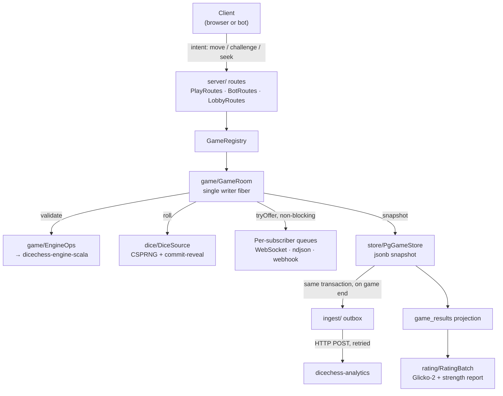
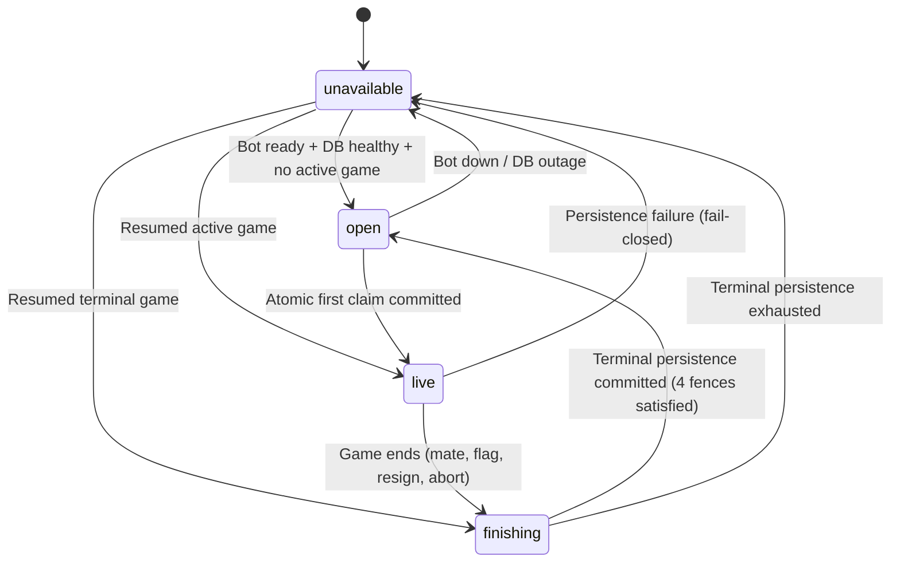

A single sbt module. The entry point is `dicechess.play.Main` (an `IOApp.Simple` serving Ember
on `0.0.0.0:8080`), which reads the environment and wires up the optional subsystems —
persistence, analytics ingest, the ladder scheduler, the rating batch, webhook push, and
retention. Each is opt-in; see [Configuration](/dicechess-play-api/configuration/).

## Package map

Everything lives under `src/main/scala/dicechess/play/`.

| Package | Owns |
| --- | --- |
| `core/` | Domain types with no dependencies: `Protocol`, `Identity` (Seat / Principal), `GameId`, `Seek`, `BotEvent` |
| `dice/` | `DiceSource` — server-only CSPRNG dice with commit-reveal fairness |
| `game/` | `GameRoom` (the actor-style room), `EngineOps` (the only engine wrapper), `PlayerConnection` |
| `server/` | http4s routes and the services behind them — the largest package |
| `store/` | `GameStore` / `PgGameStore` (doobie + Flyway), `GameArchive`, `Retention` |
| `rating/` | `Glicko2`, `RatingBatch`, and the strength report: `Sprt`, `BradleyTerry`, `StrengthReport`, `StrengthCache` |
| `ingest/` | `PlaysiteIngest` + `IngestDeliverer` — the transactional outbox to analytics |
| `wire/` | `Codecs.scala` — the Circe codecs that *are* the client wire contract |

## How a move travels

The shape to hold on to: **the room is the only writer of game state**, and everything
downstream of it — subscribers, snapshots, the outbox — is fed without ever letting a slow
consumer block play. That rule is spelled out in
[Concurrency Doctrine](/dicechess-play-api/concurrency/).

## Cross-repository contracts

`play-api` sits in the middle of four contracts. Changing either side of one without the other
is the most common way to break the platform.

- **Consumes** `lv.id.jc:dicechess-engine-scala`, a JVM artifact from GitHub Packages with the
  version pinned in `build.sbt`. It is the single source of truth for the rules — legality is
  never reimplemented here. Legal moves ship on the wire as a prefix tree of UCI micro-moves.
- **Publishes** the client wire protocol in `wire/Codecs.scala`, consumed by the
  `dicechess-play` SvelteKit front end. Both sides must be verified together.
- **Publishes** the analytics ingest payload built in `ingest/PlaysiteIngest.scala` — posted to
  the analytics service's `/api/games` with `source=playsite`, idempotent, first writer wins.
- **Publishes** the public Bot API, documented at [bots.fortemate.com](https://bots.fortemate.com/). Its
  machine-readable contracts (`openapi.yaml`, `asyncapi.yaml`) live in that site's `public/`
  directory and are rendered into the reference at build time, so the spec cannot drift
  silently from the docs.

## HTTP surface

Routes are grouped by audience rather than by resource:

- **Operational** — `GET /health`, `GET /version`.
- **Human game surface** — `POST /games`, `GET /games/{id}`, `GET /games/{id}/ws?token=…`. The
  token grants the seat; redeeming it is also when the seat learns who is sitting in it (#285),
  from the session or a `?guest=` uuid.
- **Public discovery** — `GET /games`, `GET /leaderboard`, `GET /bots/{team}/{name}`, plus the
  history and strength endpoints.
- **Showcase table** — `GET /showcase` and `POST /showcase/claim`. Exposes the homepage singleton table:
  - `GET /showcase` returns the public table view: state (`unavailable`, `open`, `live`, `finishing`), featured bot
    summary, time control (`5+3`), next human color when `open`, current game FEN and clocks when `live`/`finishing`,
    and the public spectator WebSocket URL. It enforces `Cache-Control: no-cache, no-store, must-revalidate` for active
    states (max-age 1s when `open`), requires no authentication, and **never exposes player credentials or internal tokens**.
  - `POST /showcase/claim` is the atomic first-claim endpoint. Authentication accepts either a valid session cookie
    (`user:<uuid>`) or a stable `guestId` (`guest:<uuid>`). It requires an `Idempotency-Key` header (UUIDv4) and accepts
    optional `clientEntropy`. The atomic winner receives `200 OK` with `outcome: "playing"`, assigned color, and
    `playerToken` in a `Cache-Control: no-store` body; concurrent losers and subsequent callers receive `200 OK` with
    `outcome: "spectating"` and the spectator URL, with **no player credentials**. Errors use RFC 7807 problem details:
    `400 Bad Request` (`missing_idempotency_key`), `409 Conflict` (`idempotency_conflict` on reused key with different
    payload), `429 Too Many Requests` (per-IP and per-actor claim rate limits), or `503 Service Unavailable`
    (`showcase_unavailable`). There is no queue and no rematch. The authoritative contract is ADR-005 (#44).
- **Bot API** — everything under `/bot/…`: identity, challenges, seeks, gameplay, streams,
  webhooks, ladder.
- **Account control** — `/me/…` uses the live `access_token` session and current ownership;
  `/admin/…` additionally requires the account id in `PLAY_ADMINS`. The parallel staged webhook
  roots share `SessionWebhookRoutes` and `WebhookManagement`, so only authorization differs —
  status mapping, CAS, redaction, verification, and audit cannot drift between them. They mount
  only behind `WEBHOOK_SESSION_MANAGEMENT_ENABLED` plus persistence, session verification, and an
  explicit origin allow-list; the legacy `/bot/webhook…` contract remains separate. The accepted
  security/state-machine contract is ADR-004; this page and
  [Concurrency](/dicechess-play-api/concurrency/) carry everything a contributor needs from it.

The complete, authoritative reference for the bot-facing routes is the
[Bot API site](https://bots.fortemate.com/), not this page.

## Staged webhook control plane

The staged path deliberately separates browser authorization, durable credential state, and
outbound networking:

1. `SessionWebhookRoutes` authenticates the live owner/admin session and enforces exact Origin,
   CSRF, content type, and strong `If-Match` requirements.
2. `WebhookManagement` validates the typed transition, performs a DB-authoritative authority and
   revision preflight, then consumes the shared verification budget and coordinates the lease
   around verification-v2 without exposing stored candidate material. The store repeats authority
   and CAS checks at mutation/commit time; unauthorized or stale requests spend no budget and cause
   no DNS or outbound HTTP.
3. `WebhookManagementStore` / `PgGameStore` own the authoritative revision, registration
   generation, setup/tombstone lifecycle, admin-authority heartbeat and audit transaction. Security
   deadlines use the PostgreSQL clock, and activation attempts are reserved when the lease is
   acquired.
4. `WebhookTransport` resolves and validates the candidate once, connects to that validated public
   IP, and retains the hostname for HTTP Host and TLS SNI. The ordinary delivery path reuses this
   DNS-pinned primitive and checks `registration_id` again before a response can enter `GameRoom`.

`Main` mounts the routes and supervises the 5-second admin-generation heartbeat only when the
complete staged configuration is present. A generation is live for 20 seconds; overlapping admin
allow-list generations fail closed until the old one ages out. Deployment ordering is part of the
architecture, not an operations afterthought: follow the
[staged webhook rollout runbook](/dicechess-play-api/configuration/#staged-webhook-rollout-runbook),
including the old-writer/worker drain, DNS-pinning proof, compatible runtime v2 dual-key release,
and flag-off rollback.

## Singleton showcase table

The homepage (`fortemate.com`, route `/`) exposes exactly one permanent public Dice Chess table facing
a configurable featured bot (initially `rpi3/hunter-book`) at casual/unrated `5+3`. When open, the first
visitor to claim it atomically starts one game; all other visitors spectate that same game. The existing
play site remains unchanged at `/play`.

The table moves through four public states:

1. `unavailable`: The table cannot accept claims. Set when PostgreSQL is unconfigured or unreachable,
   the featured bot's webhook is unresponsive, or startup reconciliation detects ambiguous state.
2. `open`: The table is idle, advertising the configured featured bot, `5+3`, and the server-assigned
   next human color. Exactly 1 bot capacity slot is reserved.
3. `live`: One active game against the featured bot is in progress. The winning claimant holds player
   credentials (`playerToken`), which appears **only** in the winning `POST /showcase/claim` response body under
   `Cache-Control: no-store`; spectators observe via WebSocket. `GET /showcase` and spectator outcomes
   (`outcome: "spectating"`) never include player credentials.
4. `finishing`: The game has ended in memory; terminal persistence is executing atomically. The table
   remains closed to new claims until the transaction commits.

### Fail-closed persistence and recovery rules (#47)

A showcase room runs under `Durability.Required`; every other room keeps the availability-first
`Durability.BestEffort` it always had (a failed snapshot write is logged and the game plays on in
memory). `GameRegistry` picks the mode from the game's origin, at creation and again on resume,
and refuses to create a showcase room at all over a store that does not claim durability
(`GameStore.durable` — the in-memory store does not). Under the required mode:

- **Nothing is published before it is committed.** The room's writer fiber persists a version
  first and only then updates its state and broadcasts. Turn acknowledgement (`submitTurn`'s
  verdict), spectator WebSocket events and the bot webhook's `yourTurn` are all downstream of that
  broadcast, so none of them can carry an uncommitted version. The creation snapshot — with
  `origin = 'showcase'` — is fail-closed in every mode and is what a claim's success answer
  depends on.
- **A failed write halts the room and is retried.** Forward progress stops (no command is
  processed while the write is retried), the mover's clock is credited for the stall, and every
  attempt is reported through `PersistenceTelemetry` — in production one stderr line per event
  naming the game and version, saying whether the room is retrying, has given up, or is back.
  Intermediate writes retry a bounded number of times (four, ~3 s of backoff, each attempt under
  the store's own save timeout); the ending retries **without bound**, backing off to one attempt
  every 30 s.
- **An exhausted intermediate write is a technical abort from the last durable version.** The
  unsaved move or roll is discarded — a subscriber never saw it — and the room ends with
  `termination = aborted` built from the last committed state. That abort is itself a terminal
  write and follows the terminal policy.
- **Completion follows the commit.** `GameRoom.result` — and with it the registry's
  deregistration, the admission release and the coordinator's completion hook — fires only once
  the terminal transaction (final snapshot, `game_results`, immutable `game_archive`, outbox
  payload) has committed. Duplicate deregistration is a no-op, so a repeated completion cannot
  reopen the table early.
- **Stalled sessions are released, not left hanging.** Once a write has been failing for longer
  than the stall grace (15 s), the room drops its subscribers so their WebSockets close; the room
  keeps retrying, `GameRoom.persistenceStalled` reads `true` for the coordinator to answer
  `unavailable`, and a client that reconnects sees the last durable state.
- **Restart resumes from the last durable version.** There is no partially finalised durable
  state to reconcile: the terminal write is one transaction, so a game is either still `active`
  in `games` (resumed by `GameRegistry.resume`, under the required mode again) or fully ended with
  its archive row. An in-memory ending that never committed before a crash is therefore not an
  ending — the game resumes at its last committed version, its clocks restart, and it ends again
  by play, durably.

The full specification is codified in ADR-005 (#44); concurrency and capacity invariants are detailed in
[Concurrency](/dicechess-play-api/concurrency/).

