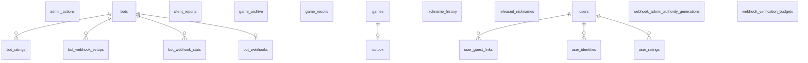

<!--
  GENERATED FILE — do not edit by hand.
  Produced by scripts/generate-schema-docs.sh from the Flyway migrations in
  src/main/resources/db/migration/. Run `mise run contrib-docs:schema` after adding a
  migration; CI regenerates this file and fails if the committed copy differs.

  This is an HTML comment, not an MDX one: the page is .md, where {/* … */} renders as
  literal text on the page.
-->

:::note[Generated from the migrations]
This page is derived by applying every Flyway migration to a real Postgres and introspecting
the result, so it cannot drift from the code. It is the *what*; the
[Database Schema](/dicechess-play-api/database/) page is the *why* — read that one first.

Regenerate with `mise run contrib-docs:schema` after adding a migration.
:::

## Entity relationships

Only foreign keys appear as edges. Seven tables carry no foreign key on purpose —
`game_results` and `game_archive` must outlive the snapshots they describe,
`client_reports` holds browser-submitted reports for games that never had a
`games` row on this server (kept separate from authoritative game data by design),
`users` is the root of the account graph the other two user tables reference,
`nickname_history`/`released_nicknames` must outlive the account a rename
describes just as readily as the one it never touched — a foreign key to `users`
would cascade away the audit trail and the hold on exactly the accounts whose
history or vacated name matters most, an account that renamed and then vanished —
and `admin_actions` (V19) is an audit of the same kind: it must keep naming an
admin who has since deleted their account, on a bot whose row may be long gone.

## Tables

### `admin_actions`

| Column | Type | Null | Default | Key |
| --- | --- | --- | --- | --- |
| `id` | `bigint` | no | `nextval('admin_actions_id_seq'::regclass)` | PK |
| `admin_user_id` | `uuid` | yes | — | — |
| `team` | `text` | no | — | — |
| `name` | `text` | no | — | — |
| `action` | `text` | no | — | — |
| `detail` | `text` | yes | — | — |
| `created_at` | `timestamp with time zone` | no | `now()` | — |
| `actor_kind` | `text` | no | `'admin'::text` | — |
| `actor_id` | `text` | yes | — | — |
| `request_id` | `text` | yes | — | — |
| `before_revision` | `uuid` | yes | — | — |
| `after_revision` | `uuid` | yes | — | — |
| `before_registration_id` | `uuid` | yes | — | — |
| `after_registration_id` | `uuid` | yes | — | — |
| `bot_incarnation_id` | `uuid` | yes | — | — |
| `metadata` | `jsonb` | no | `'{}'::jsonb` | — |

Check constraints:

- `CHECK ((actor_kind = ANY (ARRAY['owner'::text, 'admin'::text, 'bot'::text, 'system'::text])))`

Indexes:

- `admin_actions_bot_idx` — `CREATE INDEX admin_actions_bot_idx ON public.admin_actions USING btree (team, name, created_at)`
- `admin_actions_pkey` — `CREATE UNIQUE INDEX admin_actions_pkey ON public.admin_actions USING btree (id)`
- `admin_actions_request_idx` — `CREATE INDEX admin_actions_request_idx ON public.admin_actions USING btree (request_id) WHERE (request_id IS NOT NULL)`

### `bot_ratings`

| Column | Type | Null | Default | Key |
| --- | --- | --- | --- | --- |
| `team` | `text` | no | — | FK → bots(team, name), PK |
| `name` | `text` | no | — | FK → bots(team, name), PK |
| `category` | `text` | no | — | PK |
| `rating` | `double precision` | no | `1500` | — |
| `rd` | `double precision` | no | `350` | — |
| `vol` | `double precision` | no | `0.06` | — |

Check constraints:

- `CHECK ((category = ANY (ARRAY['bullet'::text, 'blitz'::text, 'rapid'::text])))`

Indexes:

- `bot_ratings_pkey` — `CREATE UNIQUE INDEX bot_ratings_pkey ON public.bot_ratings USING btree (team, name, category)`

### `bot_webhook_setups`

| Column | Type | Null | Default | Key |
| --- | --- | --- | --- | --- |
| `setup_id` | `uuid` | no | — | PK |
| `team` | `text` | no | — | FK → bots(team, name, incarnation_id) |
| `name` | `text` | no | — | FK → bots(team, name, incarnation_id) |
| `bot_incarnation_id` | `uuid` | no | — | FK → bots(team, name, incarnation_id) |
| `kind` | `text` | yes | — | — |
| `actor_kind` | `text` | yes | — | — |
| `actor_id` | `text` | yes | — | — |
| `authority_generation` | `text` | yes | — | — |
| `activation_revision` | `uuid` | yes | — | — |
| `candidate_url` | `text` | yes | — | — |
| `candidate_secret` | `text` | yes | — | — |
| `candidate_capabilities` | `text[]` | yes | — | — |
| `created_at` | `timestamp with time zone` | yes | — | — |
| `expires_at` | `timestamp with time zone` | yes | — | — |
| `activation_attempts` | `integer` | yes | `0` | — |
| `lease_id` | `uuid` | yes | — | — |
| `lease_expires_at` | `timestamp with time zone` | yes | — | — |
| `status` | `text` | no | `'pending'::text` | — |
| `terminated_at` | `timestamp with time zone` | yes | — | — |

Check constraints:

- `CHECK (((actor_kind IS NULL) OR (actor_kind = ANY (ARRAY['owner'::text, 'admin'::text]))))`
- `CHECK (((activation_attempts IS NULL) OR ((activation_attempts >= 0) AND (activation_attempts <= 5))))`
- `CHECK (((status <> 'pending'::text) OR ((kind = 'create'::text) AND (candidate_capabilities IS NOT NULL)) OR ((kind = ANY (ARRAY['replaceUrl'::text, 'rotateSecret'::text])) AND (candidate_capabilities IS NULL))))`
- `CHECK (((candidate_capabilities IS NULL) OR (candidate_capabilities = ARRAY[]::text[]) OR (candidate_capabilities = ARRAY['draws'::text])))`
- `CHECK (((status <> 'pending'::text) OR (expires_at > created_at)))`
- `CHECK (((kind IS NULL) OR (kind = ANY (ARRAY['create'::text, 'replaceUrl'::text, 'rotateSecret'::text]))))`
- `CHECK (((lease_id IS NULL) = (lease_expires_at IS NULL)))`
- `CHECK (((lease_id IS NULL) OR (activation_attempts > 0)))`
- `CHECK ((((status = 'pending'::text) AND (kind IS NOT NULL) AND (actor_kind IS NOT NULL) AND (actor_id IS NOT NULL) AND (authority_generation IS NOT NULL) AND (activation_revision IS NOT NULL) AND (candidate_url IS NOT NULL) AND (candidate_secret IS NOT NULL) AND (created_at IS NOT NULL) AND (expires_at IS NOT NULL) AND (activation_attempts IS NOT NULL) AND (terminated_at IS NULL)) OR ((status <> 'pending'::text) AND (kind IS NULL) AND (actor_kind IS NULL) AND (actor_id IS NULL) AND (authority_generation IS NULL) AND (activation_revision IS NULL) AND (candidate_url IS NULL) AND (candidate_secret IS NULL) AND (candidate_capabilities IS NULL) AND (created_at IS NULL) AND (expires_at IS NULL) AND (activation_attempts IS NULL) AND (lease_id IS NULL) AND (lease_expires_at IS NULL) AND (terminated_at IS NOT NULL))))`
- `CHECK ((status = ANY (ARRAY['pending'::text, 'activated'::text, 'cancelled'::text, 'expired'::text, 'invalidated'::text, 'attempts_exhausted'::text])))`

Indexes:

- `bot_webhook_setups_one_pending_idx` — `CREATE UNIQUE INDEX bot_webhook_setups_one_pending_idx ON public.bot_webhook_setups USING btree (team, name) WHERE (status = 'pending'::text)`
- `bot_webhook_setups_pkey` — `CREATE UNIQUE INDEX bot_webhook_setups_pkey ON public.bot_webhook_setups USING btree (setup_id)`
- `bot_webhook_setups_tombstone_expiry_idx` — `CREATE INDEX bot_webhook_setups_tombstone_expiry_idx ON public.bot_webhook_setups USING btree (terminated_at) WHERE (status <> 'pending'::text)`

### `bot_webhook_stats`

| Column | Type | Null | Default | Key |
| --- | --- | --- | --- | --- |
| `team` | `text` | no | — | FK → bots(team, name), PK |
| `name` | `text` | no | — | FK → bots(team, name), PK |
| `hour` | `timestamp with time zone` | no | — | PK |
| `outcome` | `text` | no | — | PK |
| `latency_bucket` | `smallint` | no | — | PK |
| `count` | `bigint` | no | `0` | — |

Indexes:

- `bot_webhook_stats_pkey` — `CREATE UNIQUE INDEX bot_webhook_stats_pkey ON public.bot_webhook_stats USING btree (team, name, hour, outcome, latency_bucket)`
- `bot_webhook_stats_recent_idx` — `CREATE INDEX bot_webhook_stats_recent_idx ON public.bot_webhook_stats USING btree (team, name, hour)`

### `bot_webhooks`

| Column | Type | Null | Default | Key |
| --- | --- | --- | --- | --- |
| `team` | `text` | no | — | FK → bots(team, name), PK |
| `name` | `text` | no | — | FK → bots(team, name), PK |
| `url` | `text` | no | — | — |
| `secret` | `text` | no | — | — |
| `verified_at` | `timestamp with time zone` | no | — | — |
| `created_at` | `timestamp with time zone` | no | `now()` | — |
| `last_failure_at` | `timestamp with time zone` | yes | — | — |
| `last_failure_reason` | `text` | yes | — | — |
| `capabilities` | `text[]` | no | `'{}'::text[]` | — |
| `registration_id` | `uuid` | no | `gen_random_uuid()` | — |

Check constraints:

- `CHECK (((capabilities = ARRAY[]::text[]) OR (capabilities = ARRAY['draws'::text])))`

Indexes:

- `bot_webhooks_pkey` — `CREATE UNIQUE INDEX bot_webhooks_pkey ON public.bot_webhooks USING btree (team, name)`

### `bots`

| Column | Type | Null | Default | Key |
| --- | --- | --- | --- | --- |
| `team` | `text` | no | — | PK, unique |
| `name` | `text` | no | — | PK, unique |
| `token_hash` | `text` | no | — | unique |
| `created_at` | `timestamp with time zone` | no | `now()` | — |
| `rotated_at` | `timestamp with time zone` | yes | — | — |
| `on_ladder` | `boolean` | no | `false` | — |
| `owner_external_id` | `text` | yes | — | — |
| `open_to_humans` | `boolean` | no | `false` | — |
| `description` | `text` | yes | — | — |
| `max_concurrent_games` | `integer` | no | `1` | — |
| `rated_for_humans` | `boolean` | no | `false` | — |
| `incarnation_id` | `uuid` | no | `gen_random_uuid()` | unique |
| `webhook_revision` | `uuid` | no | `gen_random_uuid()` | — |
| `ownership_generation` | `bigint` | no | `0` | — |

Check constraints:

- `CHECK (((max_concurrent_games >= 1) AND (max_concurrent_games <= 32)))`

Indexes:

- `bots_owner_idx` — `CREATE INDEX bots_owner_idx ON public.bots USING btree (owner_external_id) WHERE (owner_external_id IS NOT NULL)`
- `bots_pkey` — `CREATE UNIQUE INDEX bots_pkey ON public.bots USING btree (team, name)`
- `bots_token_hash_key` — `CREATE UNIQUE INDEX bots_token_hash_key ON public.bots USING btree (token_hash)`
- `bots_webhook_incarnation_unique` — `CREATE UNIQUE INDEX bots_webhook_incarnation_unique ON public.bots USING btree (team, name, incarnation_id)`

### `client_reports`

| Column | Type | Null | Default | Key |
| --- | --- | --- | --- | --- |
| `report_id` | `uuid` | no | — | PK |
| `payload` | `jsonb` | no | — | — |
| `attempts` | `integer` | no | `0` | — |
| `next_attempt_at` | `timestamp with time zone` | no | `now()` | — |
| `failed_permanently` | `boolean` | no | `false` | — |
| `last_error` | `text` | yes | — | — |
| `created_at` | `timestamp with time zone` | no | `now()` | — |
| `delivered_at` | `timestamp with time zone` | yes | — | — |

Indexes:

- `client_reports_due_idx` — `CREATE INDEX client_reports_due_idx ON public.client_reports USING btree (next_attempt_at) WHERE ((delivered_at IS NULL) AND (NOT failed_permanently))`
- `client_reports_pkey` — `CREATE UNIQUE INDEX client_reports_pkey ON public.client_reports USING btree (report_id)`

### `game_archive`

| Column | Type | Null | Default | Key |
| --- | --- | --- | --- | --- |
| `game_id` | `uuid` | no | — | PK |
| `payload` | `jsonb` | no | — | — |
| `finished_at` | `timestamp with time zone` | no | `now()` | — |

Indexes:

- `game_archive_pkey` — `CREATE UNIQUE INDEX game_archive_pkey ON public.game_archive USING btree (game_id)`

### `game_results`

| Column | Type | Null | Default | Key |
| --- | --- | --- | --- | --- |
| `game_id` | `uuid` | no | — | PK |
| `white_external_id` | `text` | no | — | — |
| `black_external_id` | `text` | no | — | — |
| `result` | `smallint` | yes | — | — |
| `termination` | `text` | no | — | — |
| `rated` | `boolean` | no | — | — |
| `time_control` | `text` | no | — | — |
| `server_seed` | `text` | no | — | — |
| `pairing_id` | `uuid` | yes | — | — |
| `finished_at` | `timestamp with time zone` | no | `now()` | — |
| `rating_applied_at` | `timestamp with time zone` | yes | — | — |
| `ladder` | `boolean` | no | `false` | — |
| `white_rating_before` | `double precision` | yes | — | — |
| `white_rating_after` | `double precision` | yes | — | — |
| `black_rating_before` | `double precision` | yes | — | — |
| `black_rating_after` | `double precision` | yes | — | — |
| `category` | `text` | yes | — | — |

Indexes:

- `game_results_black_finished_idx` — `CREATE INDEX game_results_black_finished_idx ON public.game_results USING btree (black_external_id, finished_at DESC)`
- `game_results_ladder_idx` — `CREATE INDEX game_results_ladder_idx ON public.game_results USING btree (ladder) WHERE ladder`
- `game_results_pairing_idx` — `CREATE INDEX game_results_pairing_idx ON public.game_results USING btree (pairing_id) WHERE (pairing_id IS NOT NULL)`
- `game_results_pkey` — `CREATE UNIQUE INDEX game_results_pkey ON public.game_results USING btree (game_id)`
- `game_results_rated_finished_idx` — `CREATE INDEX game_results_rated_finished_idx ON public.game_results USING btree (rated, finished_at)`
- `game_results_rating_queue_idx` — `CREATE INDEX game_results_rating_queue_idx ON public.game_results USING btree (finished_at) WHERE (rated AND (rating_applied_at IS NULL))`
- `game_results_white_finished_idx` — `CREATE INDEX game_results_white_finished_idx ON public.game_results USING btree (white_external_id, finished_at DESC)`

### `games`

| Column | Type | Null | Default | Key |
| --- | --- | --- | --- | --- |
| `id` | `uuid` | no | — | PK |
| `status` | `text` | no | — | — |
| `snapshot` | `jsonb` | no | — | — |
| `created_at` | `timestamp with time zone` | no | `now()` | — |
| `updated_at` | `timestamp with time zone` | no | `now()` | — |

Check constraints:

- `CHECK ((status = ANY (ARRAY['active'::text, 'ended'::text])))`

Indexes:

- `games_active_idx` — `CREATE INDEX games_active_idx ON public.games USING btree (status) WHERE (status = 'active'::text)`
- `games_pkey` — `CREATE UNIQUE INDEX games_pkey ON public.games USING btree (id)`

### `nickname_history`

| Column | Type | Null | Default | Key |
| --- | --- | --- | --- | --- |
| `id` | `bigint` | no | `nextval('nickname_history_id_seq'::regclass)` | PK |
| `user_id` | `uuid` | no | — | — |
| `old_nickname` | `text` | no | — | — |
| `new_nickname` | `text` | no | — | — |
| `changed_at` | `timestamp with time zone` | no | `now()` | — |

Indexes:

- `nickname_history_old_name_idx` — `CREATE INDEX nickname_history_old_name_idx ON public.nickname_history USING btree (lower(old_nickname))`
- `nickname_history_pkey` — `CREATE UNIQUE INDEX nickname_history_pkey ON public.nickname_history USING btree (id)`
- `nickname_history_user_idx` — `CREATE INDEX nickname_history_user_idx ON public.nickname_history USING btree (user_id, changed_at)`

### `outbox`

| Column | Type | Null | Default | Key |
| --- | --- | --- | --- | --- |
| `game_id` | `uuid` | no | — | FK → games(id), PK |
| `payload` | `jsonb` | no | — | — |
| `attempts` | `integer` | no | `0` | — |
| `next_attempt_at` | `timestamp with time zone` | no | `now()` | — |
| `failed_permanently` | `boolean` | no | `false` | — |
| `last_error` | `text` | yes | — | — |
| `created_at` | `timestamp with time zone` | no | `now()` | — |
| `delivered_at` | `timestamp with time zone` | yes | — | — |

Indexes:

- `outbox_due_idx` — `CREATE INDEX outbox_due_idx ON public.outbox USING btree (next_attempt_at) WHERE ((delivered_at IS NULL) AND (NOT failed_permanently))`
- `outbox_pkey` — `CREATE UNIQUE INDEX outbox_pkey ON public.outbox USING btree (game_id)`

### `released_nicknames`

| Column | Type | Null | Default | Key |
| --- | --- | --- | --- | --- |
| `nickname_lower` | `text` | no | — | — |
| `previous_owner_id` | `uuid` | no | — | — |
| `released_at` | `timestamp with time zone` | no | `now()` | — |
| `expires_at` | `timestamp with time zone` | no | — | — |

Indexes:

- `released_nicknames_lookup_idx` — `CREATE INDEX released_nicknames_lookup_idx ON public.released_nicknames USING btree (nickname_lower, expires_at)`

### `user_guest_links`

| Column | Type | Null | Default | Key |
| --- | --- | --- | --- | --- |
| `guest_id` | `uuid` | no | — | PK |
| `user_id` | `uuid` | no | — | FK → users(id) |
| `linked_at` | `timestamp with time zone` | no | `now()` | — |

Indexes:

- `user_guest_links_pkey` — `CREATE UNIQUE INDEX user_guest_links_pkey ON public.user_guest_links USING btree (guest_id)`
- `user_guest_links_user_idx` — `CREATE INDEX user_guest_links_user_idx ON public.user_guest_links USING btree (user_id)`

### `user_identities`

| Column | Type | Null | Default | Key |
| --- | --- | --- | --- | --- |
| `provider` | `text` | no | — | PK |
| `subject` | `text` | no | — | PK |
| `user_id` | `uuid` | no | — | FK → users(id) |
| `email` | `text` | yes | — | — |
| `created_at` | `timestamp with time zone` | no | `now()` | — |

Indexes:

- `user_identities_pkey` — `CREATE UNIQUE INDEX user_identities_pkey ON public.user_identities USING btree (provider, subject)`
- `user_identities_user_idx` — `CREATE INDEX user_identities_user_idx ON public.user_identities USING btree (user_id)`

### `user_ratings`

| Column | Type | Null | Default | Key |
| --- | --- | --- | --- | --- |
| `user_id` | `uuid` | no | — | FK → users(id), PK |
| `category` | `text` | no | — | PK |
| `rating` | `double precision` | no | `1500` | — |
| `rd` | `double precision` | no | `350` | — |
| `vol` | `double precision` | no | `0.06` | — |

Check constraints:

- `CHECK ((category = ANY (ARRAY['bullet'::text, 'blitz'::text, 'rapid'::text])))`

Indexes:

- `user_ratings_pkey` — `CREATE UNIQUE INDEX user_ratings_pkey ON public.user_ratings USING btree (user_id, category)`

### `users`

| Column | Type | Null | Default | Key |
| --- | --- | --- | --- | --- |
| `id` | `uuid` | no | — | PK |
| `nickname` | `text` | no | — | — |
| `created_at` | `timestamp with time zone` | no | `now()` | — |
| `last_login_at` | `timestamp with time zone` | yes | — | — |
| `is_active` | `boolean` | no | `true` | — |
| `nickname_changed_at` | `timestamp with time zone` | yes | — | — |

Indexes:

- `users_nickname_ci_idx` — `CREATE UNIQUE INDEX users_nickname_ci_idx ON public.users USING btree (lower(nickname))`
- `users_pkey` — `CREATE UNIQUE INDEX users_pkey ON public.users USING btree (id)`

### `webhook_admin_authority_generations`

| Column | Type | Null | Default | Key |
| --- | --- | --- | --- | --- |
| `authority_generation` | `text` | no | — | PK |
| `heartbeat_at` | `timestamp with time zone` | no | `clock_timestamp()` | — |

Check constraints:

- `CHECK ((authority_generation ~ '^[0-9a-f]{64}$'::text))`

Indexes:

- `webhook_admin_authority_generations_pkey` — `CREATE UNIQUE INDEX webhook_admin_authority_generations_pkey ON public.webhook_admin_authority_generations USING btree (authority_generation)`
- `webhook_admin_authority_heartbeat_idx` — `CREATE INDEX webhook_admin_authority_heartbeat_idx ON public.webhook_admin_authority_generations USING btree (heartbeat_at)`

### `webhook_verification_budgets`

| Column | Type | Null | Default | Key |
| --- | --- | --- | --- | --- |
| `budget_kind` | `text` | no | — | PK |
| `budget_key` | `text` | no | — | PK |
| `window_started_at` | `timestamp with time zone` | no | — | — |
| `window_expires_at` | `timestamp with time zone` | no | — | — |
| `attempts` | `integer` | no | — | — |

Check constraints:

- `CHECK ((attempts >= 1))`
- `CHECK ((budget_kind = ANY (ARRAY['setup_actor_bot'::text, 'activation_actor_bot'::text, 'activation_source_ip'::text])))`
- `CHECK ((window_expires_at > window_started_at))`

Indexes:

- `webhook_verification_budgets_expiry_idx` — `CREATE INDEX webhook_verification_budgets_expiry_idx ON public.webhook_verification_budgets USING btree (window_expires_at)`
- `webhook_verification_budgets_pkey` — `CREATE UNIQUE INDEX webhook_verification_budgets_pkey ON public.webhook_verification_budgets USING btree (budget_kind, budget_key)`
