**Status:** Accepted for implementation; the public capability remains reserved until the rollout gate.

**Date:** 2026-09-03

**Decision owner:** `dicechess-play-api`

## Context

The engine can advise whether a bot should offer or accept a double, and the practice client has a
dormant x2 flow. Neither is authoritative for live play. The server must own the order of decisions,
clocks, dice reveal, reconnect state, persistence, and settlement. Copying the practice state machine
would leave those boundaries undefined and would make a browser authoritative over a stake.

The existing draw implementation already establishes one important invariant: a decision that can end
the game is resolved before the next dice are revealed. Stake doubling extends that pre-roll gate, but
it differs from a draw response because the responder to a double is not the player whose turn will
continue after an acceptance.

The contract is designed here before any room, route, runtime, client, wallet, or analytics behaviour is
enabled. The canonical machine-readable draft and examples live under
`docs/public/contracts/stake-doubling/v1/`; the live OpenAPI and AsyncAPI documents do not advertise the
new operations until an implementation serves them.

## Decision

Live play-api games **will support stake doubling**, initially for explicitly opted-in catalog
human-vs-bot games and direct bot challenges. The v1 stake is a positive integer amount of
`PLAY_CREDIT`: a closed-loop, non-purchasable and non-redeemable game credit. The protocol is not a
money, cryptocurrency, token, prize, or wallet-transfer API. Supporting anything with external value is
a separate product, security, and compliance decision and is outside this ADR.

`stake` always means one seat's exposure, not the combined pot. At game creation both seats authorize
and reserve their maximum possible exposure:

```text
maximum exposure per seat = initialStake * maximumMultiplier
```

The amount is reserved before the room starts and released or settled exactly once by game id. The
public protocol carries amounts and the fixed currency name, but never wallet ids, balances,
reservation ids, credentials, or settlement implementation details. Pre-reserving the maximum avoids
mid-game balance checks, affordability leaks, and an involuntary drop caused by insufficient funds.

Staked games are always casual (`rated = false`) and require durable PostgreSQL-backed operation.
Requests combining a stake with `rated = true`, an anonymous participant, an unsupported creation
surface, unavailable persistence, an unreserved seat, or a bot without the `doubling` capability are
rejected rather than silently downgraded.

### Supported admission surfaces

The first protocol version permits explicit opt-in on:

- `POST /lobby/play-bot` for a signed-in human and a catalog bot whose current registration selects
  `doubling`;
- `POST /bot/challenge` for two registered bots. The challenge stores the complete stake offer. The
  challenger reservation is held while the challenge is pending; the target reservation and current
  `doubling` capability are checked atomically on acceptance. Decline or expiry releases the held
  reservation.

The `stake` member is required as a whole and has no partial defaults:

```json
{
  "amount": 10,
  "currency": "PLAY_CREDIT",
  "maximumMultiplier": 64
}
```

Omission means an ordinary non-staked game. `amount` is a positive integer,
`maximumMultiplier` is one of `2, 4, 8, 16, 32, 64`, and checked multiplication must fit the
platform's persisted integer amount type. The API rejects any other currency or multiplier.

Friend-by-link `POST /games`, open seeks, ladder games, and the showcase table remain non-staked in
v1. Friend links do not know the second participant at creation, open seeks need a durable reservation
lifecycle of their own, and automated surfaces must never opt players into stakes implicitly.

### Cube and settlement semantics

- The cube starts centered: `cubeValue = 1`, `cubeOwner = null`.
- `currentStake = initialStake * cubeValue` at every committed version.
- Before rolling on its own turn, a seat may offer only when the cube is centered or owned by that
  seat, no draw or double response is pending, and `cubeValue < maximumMultiplier`.
- An offer proposes `currentStake * 2`. The current stake does not change merely because it was
  offered.
- Acceptance doubles `cubeValue`, changes `currentStake`, and transfers `cubeOwner` to the responder.
- Explicit decline ends the game immediately. The responder loses the **current pre-offer stake**;
  the unaccepted proposed amount is never settled.
- A king capture, ordinary resignation, or clock timeout settles the current accepted stake. A draw
  settles zero net credits. A technical abort releases both reservations with zero net settlement.
- No rake or asymmetric payout is part of this protocol. The winner's net change is `+currentStake`
  and the loser's is `-currentStake`.

### Authoritative phases

`GameRoom` remains the sole writer. A staked turn moves through these phases:

```mermaid
stateDiagram-v2
    [*] --> drawResponse: prior turn offered draw
    [*] --> doubleOpportunity: no pending draw
    drawResponse --> [*]: accept draw
    drawResponse --> doubleOpportunity: decline draw
    doubleOpportunity --> diceRevealed: roll
    doubleOpportunity --> doubleResponse: offer double
    doubleResponse --> [*]: decline / response timeout
    doubleResponse --> diceRevealed: accept; original turn resumes
    diceRevealed --> turnComplete: move or forced pass
    turnComplete --> drawResponse: outgoing draw offered
    turnComplete --> doubleOpportunity: no draw offer
```



The complete order is:

1. Finish the previous turn and commit its `TurnPlayed` event.
2. If that turn offered a draw, resolve the draw first. No doubling decision exists while a draw is
   pending.
3. If the turn owner is eligible to offer, enter a `doubleOpportunity` decision before deriving or
   revealing any dice. The turn owner chooses either roll or offer. If it is ineligible because the
   cube belongs to the opponent or is at the multiplier cap, no decision is created and the existing
   automatic roll path continues.
4. On an offer, commit `DoubleOffered`, pause the turn owner's clock, and make the opponent the active
   decision seat. The board position does not change.
5. On acceptance, charge the responder's decision time, commit `DoubleAccepted`, update the cube and
   stake, restore the original turn owner, and continue directly to the roll. Ownership has moved to
   the responder, so the original turn owner cannot immediately re-offer.
6. Only an explicit roll choice or an ineligible automatic path asks `DiceSource` for the roll,
   commits `DiceRolled`, and opens the move phase. A forced pass is processed after reveal exactly as
   today.

`activeSeat` identifies the actor currently required to answer. During `doubleResponse` that is the
responder. The active-colour field of `dfen` remains the actual chess side to move, and
`doubling.turnSeat` names that same seat throughout the out-of-turn response. Runtime consumers use the
explicit decision `seat` when evaluating the responder's perspective; the server never fabricates a
different board turn. Move counters, castling state, en-passant state, and history do not change.

### Clocks and absence

The seat named by `activeSeat` pays for its own decision:

- the turn owner's ordinary clock runs during `doubleOpportunity` and the move phase;
- creating an offer charges elapsed time to the turn owner, then pauses that clock;
- the responder's clock runs during `doubleResponse`; acceptance charges that elapsed time without a
  Fischer increment, then the original turn owner's remaining time resumes;
- for `PerMove`, the response gets one per-move budget and does not consume the responder's future turn
  budget; for `Unlimited`, the existing anti-abandonment deadline applies;
- the first of clock expiry and disconnect grace wins. A responder timeout/drop loses at the current
  stake, but retains its factual `Timeout`/`Resign` termination rather than being mislabeled as an
  explicit cube decline;
- an offerer that resigns or disconnects while waiting loses normally at the current stake. The
  unaccepted offer is not turned into a responder decline.

Webhook transport failures never become an immediate financial decision. A missing, malformed,
oversized, late, non-200, or wrong-kind response leaves the authoritative decision pending and the
responder's clock decides. The runtime's safe default response is an explicit decline; that default is
used only when the signed callback was successfully invoked.

### Idempotency, retries, and reconnect

Every pre-roll decision has an opaque `decisionId`. It is persisted before publication and remains
stable across snapshots, stream reconnects, webhook redelivery after process restart, and client retry.
The accepted action and its outcome are retained with the snapshot.

- Repeating the same action for the same `decisionId` returns the original outcome and emits no event.
- A different action for an already resolved id, an unknown id, a decision for another seat, or an
  action whose kind does not match returns `409` without changing state.
- At most one `DoubleOffered`, `DoubleAccepted`, `DoubleDeclined`, or `DiceRolled` transition can result
  from one decision id.
- A reconnecting client receives a `Snapshot` with the exact pending decision and acts from that state;
  it does not infer a decision from the absence of dice.

## Public state and transport contract

Classic games omit `doubling` or send it as `null`; clients must treat both forms identically. Staked
games always send the complete object. The schema fixes these fields:

- `currency`, `initialStake`, `currentStake`;
- `cubeValue`, nullable `cubeOwner`, and `maximumMultiplier`;
- `mayOfferDouble`, computed for the current decision actor;
- `turnSeat`, which survives the out-of-turn response phase;
- nullable `decision`, tagged as `offer` or `response`, with its stable id, actor, and proposed stake.

The public Bot API page contains the exact JSON examples and endpoint mapping. In code the transport-
neutral command vocabulary becomes:

```json
{ "RequestRoll": { "decisionId": "double_01K4F4Y7M8R2" } }
{ "OfferDouble": { "decisionId": "double_01K4F4Y7M8R2" } }
{ "RespondDouble": { "decisionId": "double_01K4F4Y7M8R2", "accept": true } }
```

The event vocabulary becomes `DoubleOpportunity`, `DoubleOffered`, `DoubleAccepted`, and
`DoubleDeclined`. A declined event carries a machine-readable reason; `GameEnded.termination` remains
the factual game termination. The Bot API exposes equivalent synchronous REST actions and two signed
webhook delivery types:

- `doubleOpportunity` -> `{ "decisionId": "...", "offerDouble": false }` (false means roll);
- `doubleDecision` -> `{ "decisionId": "...", "acceptDouble": false }`.

Both contexts are dice-free. `yourTurn` is delivered only after `DiceRolled` and continues to use the
existing move response. The runtime maps the two new deliveries to independent optional strategy
methods, `DoubleOfferAction` and `DoubleResponseAction`, each defaulting to `false`.

## Capability and compatibility

The canonical `doubling` capability stays `reserved` and unselectable while this document and its
schemas land. Making it `available` is a separate rollout action after server state, durable storage,
runtime, analytics, and at least one end-to-end consumer are deployed.

Legacy safety is admission-time, not a financially meaningful auto-action:

- absence of `stake` creates the existing classic game with byte-compatible behaviour;
- a bot without `doubling` cannot enter a staked game;
- capability support is snapshotted into the admitted game. Removing or deleting a webhook later does
  not rewrite the game contract; delivery stops and the ordinary clock/disconnect rules apply;
- unknown new stream events and optional `PublicGameState.doubling` remain additive for spectators,
  but old playing clients are never admitted to a game they did not explicitly request;
- the server does not switch `doubling` to available or admit a staked game merely because schema
  components exist.

## Persistence, history, and analytics

The durable game snapshot must contain the stake agreement, cube value and owner, turn seat, pending
decision, resolved-decision outcomes, reservation references (private), and the ordered doubling event
history. Staked rooms use required durability. A state version is published only after its snapshot is
committed.

The terminal snapshot transaction also commits one idempotent settlement instruction and the existing
archive/analytics outbox entries before `GameEnded` is published. Applying the instruction may be
asynchronous, but replaying it by game id cannot transfer credits twice.

The existing analytics wire vocabulary is retained, with one ambiguity resolved: for play-api,
`initial_stake_amount` and `final_stake_amount` are one seat's exposure, matching the current
`dicechess-play` producer. They are not a two-seat pot. Existing analytics prose that calls these
columns a pot must be corrected by the ingest follow-up. The legacy `*_money_delta` column names carry
closed-loop play-credit changes for this source and do not imply money.

| Result | Analytics projection |
| --- | --- |
| staked game | `mode = "x2"`, `stake_currency = "PLAY_CREDIT"` |
| creation | `initial_stake_amount = initialStake` |
| terminal | `final_stake_amount = currentStake` |
| offer | `DOUBLE_OFFER`, actor is offerer, payload `bank` is proposed stake |
| accept | `DOUBLE_ACCEPT`, actor is responder, payload `bank` is the new current stake |
| explicit/implicit drop | `DOUBLE_DECLINE`, actor is responder, payload `bank` is proposed stake and also carries `settled_stake` plus `reason` |
| explicit decline | `termination = "double_declined"` |
| timeout/disconnect | factual `timeout`/`resign` termination; decline reason preserves the cube outcome |
| draw | zero net play-credit deltas and `draw_agreement` termination |
| technical abort | zero-net ledger release; retained in play-api audit/history and not ingested as a sporting game |

Each event also records the offer id, cube value/owner, both clocks, and the one-based turn number of
the pre-roll phase. Analytics must exclude non-voluntary reasons such as timeout or disconnect from
cube-choice quality metrics. An offer cancelled because the offerer ended the game can remain
unpaired; it is not fabricated into a responder decision.

## Verification scenarios

Implementation is not complete until tests pin all of these sequences:

| Scenario | Required result |
| --- | --- |
| roll without offer | one opportunity and one dice reveal; a retry reveals no second roll |
| accepted offer | stake doubles, ownership moves to responder, original turn resumes without dice leakage |
| explicit decline | responder loses current stake; proposed stake is never settled |
| response timeout | responder loses current stake with `Timeout`, not explicit-decline termination |
| disconnect | first of decision deadline and disconnect grace wins and settles exactly once |
| duplicate response | identical response replays the verdict; conflicting response is `409` |
| reconnect/restart | same decision id and phase are restored from the durable snapshot |
| pending draw | draw resolves before any double opportunity |
| forced pass | no precomputed dice; after roll the ordinary forced-pass path runs |
| multiplier cap / wrong owner | no opportunity is created; the ordinary automatic roll path continues; an unsolicited offer is rejected |
| game end during offer | only the factual terminal action settles; no fabricated acceptance |
| legacy bot/client | cannot be admitted to a staked game; classic behaviour is unchanged |

## Rollout and rollback

The rollout is closed by default and ordered:

1. Merge this ADR and the reserved schema fixtures; `doubling` remains unselectable.
2. Implement durable play-credit reservation and idempotent settlement.
3. Implement room state, persistence, history, REST/stream/webhook transport, and contract tests behind
   disabled admission and capability flags.
4. Implement the accepted contract in `dicechess-bot-runtime`, then migrate representative bots.
5. Implement analytics ingest/projections and the authenticated play client.
6. Exercise offer, take, drop, timeout, disconnect, retry, reconnect, restart, draw, forced-pass, and
   terminal settlement sequences in staging.
7. In a human-controlled rollout, make `doubling` selectable, re-register compatible bots, then enable
   new-game admission.

Rollback disables **new** staked-game admission first. Existing staked games retain their snapshotted
contract and are allowed to settle; disabling callbacks or removing their capability mid-game is not a
safe rollback. Releases, feature-flag changes, registrations, migrations, and production cutover remain
human-only.

### Implementation issue graph

The GO decision is decomposed into independently mergeable work:

- [play-api #60](https://github.com/fortemate/dicechess-play-api/issues/60) — durable play-credit
  reservation and settlement primitives; a sub-issue of the existing
  [wallet Epic](https://github.com/fortemate/dicechess-play/issues/40);
- [play-api #61](https://github.com/fortemate/dicechess-play-api/issues/61) — authoritative room state;
- [play-api #62](https://github.com/fortemate/dicechess-play-api/issues/62) — REST, stream, snapshot,
  and webhook transport after #61;
- [play-api #63](https://github.com/fortemate/dicechess-play-api/issues/63) — required persistence,
  history, settlement instruction, and analytics outbox after #60 and #61;
- [analytics #27](https://github.com/fortemate/dicechess-analytics/issues/27) — accepted play-credit
  ingest semantics;
- [runtime #15](https://github.com/fortemate/dicechess-bot-runtime/issues/15) — the already-tracked
  typed bot decision contract;
- [play #68](https://github.com/fortemate/dicechess-play/issues/68) — live client integration after
  #60 and #62, under the existing x2 Epic;
- [play-api #64](https://github.com/fortemate/dicechess-play-api/issues/64) — the human-only rollout
  gate, natively blocked by every required server, runtime, analytics, client, release, and compatible
  bot predecessor.

## Consequences

The design adds a pre-roll actor transition and requires stricter durability than classic games. In
return, dice secrecy, financial state, retries, and reconnects have one authority, bots receive enough
information without wallet data, and every unsupported participant fails before a stake exists.

The practice client remains source material only. Its useful cube/analytics vocabulary is retained, but
its client-side balance mutation and insufficient-funds drop are deliberately not copied.
